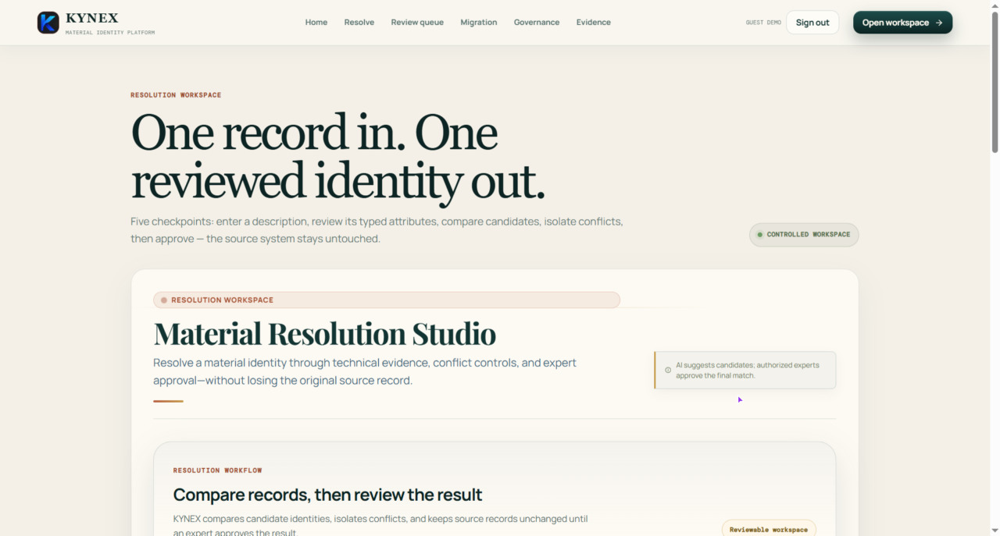
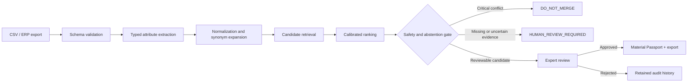

# KYNEX
### Material Identity Resolution for Industrial Procurement Data

> Evidence proposes. Deterministic safety controls can block. Authorized experts decide.


KYNEX is a human-governed material identity resolution platform for industrial and CPSE procurement data. It compares inconsistent ERP and catalogue descriptions, identifies likely common material identities, detects technical conflicts, and creates exportable mappings only after an authorized expert reviews the evidence.

KYNEX does not silently overwrite source records, treat textual similarity as engineering equivalence, or automatically publish a material mapping.



*KYNEX normalizes configured technical attributes, ranks candidates, blocks critical conflicts, preserves source lineage, and routes uncertain cases for expert review.*

**[Quick start](#quick-start) · [Website walkthrough](#website-walkthrough) · [How it works](#how-it-works) · [Safety boundary](#safety-boundary) · [Architecture](#architecture) · [Evaluation](#evaluation)**

## Why KYNEX

Industrial organizations often hold multiple codes and descriptions for the same or closely related items across plants, catalogues, suppliers, and ERP systems. Text-only deduplication can create unsafe substitutions when pressure class, material grade, nominal size, connection type, or component type differs.

Most catalogue-cleaning workflows treat similarity as a merge decision. KYNEX does not.

| Situation | KYNEX response |
|---|---|
| Similar wording or configured synonym | Retrieves and ranks candidate identities |
| Configured unit variation, such as `2 in → DN50 / 50 mm` | Compares typed normalized attributes |
| Critical mismatch, such as `PN16` versus `PN25` | Blocks publication with `DO_NOT_MERGE` |
| Missing, ambiguous, or low-margin evidence | Returns `HUMAN_REVIEW_REQUIRED` |
| Approved expert decision | Creates a controlled exportable mapping |
| Original ERP or catalogue record | Retained as a lineage-linked source record |
| Engineering interchangeability | Never assumed from textual similarity alone |

> A high similarity score cannot override a critical conflict in pressure class, material grade, size, component type, or another configured safety-critical attribute.

## Quick start

### Requirements

- Node.js 20 or later
- npm 10 or later

Check the installed versions:

```bash
node --version
npm --version
```

### Install and run the complete local walkthrough

```bash
npm install
npm run dev:full
```

Open:

- Live website: [https://kynex-material-intelligence-s62m.onrender.com](https://kynex-material-intelligence-s62m.onrender.com)
- API health check: [http://localhost:8787/api/health](http://localhost:8787/api/health)

`dev:full` starts the Vite frontend and Node API together. The default local mode is explicit demo mode when no `.env.local` overrides it.

### Run frontend and API separately

```bash
npm run dev
```

In a second terminal:

```bash
npm run api
```

### Troubleshooting

| Issue | Likely cause | Action |
|---|---|---|
| Port `5173` is unavailable | Another Vite process is running | Stop the process or configure another frontend port |
| Port `8787` is unavailable | Another API process is running | Stop the process or update `PORT` |
| `npm install` fails | Unsupported Node/npm version | Use Node.js 20+ and npm 10+ |
| Frontend cannot reach the API | API process is not running | Start `npm run api` and verify `/api/health` |
| Protected action is denied | Required-auth mode or insufficient role | Check `.env.local`, token state, and role assignment |

## Website walkthrough

### Reproduce the core behavior in about one minute

1. Open the application and choose **Open resolution workspace**.
2. Enter: `SS GATE VALVE 2 IN PN16 FLG`.
3. Inspect the extracted fingerprint: valve type, stainless material family, nominal size, pressure class, and flanged connection.
4. Compare ranked candidates and their supporting evidence.
5. Observe that a `PN25` candidate cannot be merged with a `PN16` identity.
6. Open **Review queue** to inspect held and uncertain decisions.
7. Open **Migration preview** to verify retained source records and the export-only boundary.
8. Open **Governance** and **Evidence** to inspect reviewer responsibility, auditability, and prototype limitations.

**Expected result:** KYNEX may recommend a candidate identity, but it never silently merges or publishes records. Final publication requires an authorized reviewer.

## How it works

```text
CSV / ERP export
      ↓
Schema validation and source-lineage anchor
      ↓
Typed attribute extraction and configured normalization
      ↓
Candidate retrieval and calibrated ranking
      ↓
Deterministic conflict firewall + abstention gate
      ↓
Expert review and decision history
      ↓
Approved export / Material Passport
```

### Decision states

| Engine state | Meaning | Publication |
|---|---|---|
| `exact_identity` | Typed attributes and normalized wording strongly agree | Expert approval still required |
| `functional_equivalence` | Material family and function align, but substitution needs review | Expert approval still required |
| `abstain` | Evidence is missing, ambiguous, or too close to classify safely | Held for review |
| `conflict` | A critical technical attribute differs | `DO_NOT_MERGE` |
| `approve` / `approve_substitution` | Authorized reviewer records an approval action | Eligible for controlled export |
| `reject` / `request_clarification` | Reviewer rejects or requests more evidence | Not published |

### Example safety decision

| Extracted attribute | Candidate attribute | Result |
|---|---|---|
| Pressure class: `PN16` | Pressure class: `PN25` | `DO_NOT_MERGE` |
| Nominal size: `2 in` | Nominal size: `50 mm` | Compatible only through configured normalization |
| Connection: `FLG` | Connection: `Flanged` | Configured synonym match |

The pressure-class conflict is a deterministic block. Candidate similarity and model confidence cannot override it.

## Product surfaces

| Surface | Purpose | Evidence |
|---|---|---|
| **Resolve** | Extract attributes, rank candidates, and explain the proposed identity | [Resolve screenshot](public/screenshots/resolve-workspace.png) |
| **Review queue** | Route conflicts, abstentions, and low-margin decisions to reviewers | [Review screenshot](public/screenshots/review-queue.png) |
| **Migration preview** | Inspect aliases, retained records, held conflicts, and export boundaries | [Migration screenshot](public/screenshots/migration-preview.png) |
| **Governance** | Inspect approval responsibility, decision history, and publication controls | [Governance screenshot](public/screenshots/governance.png) |
| **Evidence** | Separate implemented behavior from future CPSE pilot evidence | [Evidence screenshot](public/screenshots/evidence.png) |
| **Material Passport** | Prepare a lineage-linked governed identity record after approval | [Passport panel screenshot](public/screenshots/material-passport.png) |

The Material Passport and export surfaces are implemented through the local API and governance workspace. They preserve native identifiers and record the approval boundary rather than claiming official national-code authority.

## Safety boundary

KYNEX is a decision-support and governance prototype, not an autonomous merge engine.

- Critical conflicts can produce `DO_NOT_MERGE`.
- Missing or insufficient evidence can produce `HUMAN_REVIEW_REQUIRED`.
- Automatic publication is disabled.
- Native codes and descriptions remain intact.
- Export creation and Material Passport publication require the `material_master_officer` role.
- In `required` mode, the Node API verifies Supabase bearer tokens before protected mutations.
- Client-side controls improve usability but are not treated as authorization.
- Demo mode is explicit and intended only for local evaluation.

Supported role hierarchy:

`viewer` → `reviewer` → `material_master_officer` → `admin`

KYNEX generates a proposed governed identity or cross-reference mapping. It does not create an official national material code, certify engineering interchangeability, or replace the responsible engineer’s approval.

## Architecture



### Trust boundaries

- **React/Vite frontend:** visualizes evidence and collects user actions.
- **Node API:** performs resolution, persistence, role checks, audit logging, and export creation.
- **SQLite:** local evaluation persistence for resolutions, reviews, audits, exports, passports, and measurements.
- **Supabase:** optional connected authentication provider for `KYNEX_AUTH_MODE=required`.
- **Source data:** retained as references; the workflow does not silently overwrite legacy records.

## Technical approach

The resolution engine combines:

- domain synonym expansion, including `VLV`, `VALVE`, `SS316`, `FLG`, and `DN`
- typed fingerprint extraction for category, type, material, diameter, pressure class, connection, and unit of measure
- lexical similarity and attribute agreement
- taxonomy and unit signals
- a calibrated logistic reranker
- deterministic critical-attribute conflict checks
- margin-based abstention and missing-evidence checks
- standards context shown as reference information, not automatic engineering approval

The system separates retrieval and ranking from the decision boundary. A high similarity score cannot override a critical technical conflict.

## Data contract

Material imports require:

```text
org,code,description
```

Supported optional fields include:

```text
plant,event_year,entity_key,erp_system,language,supplier,family
```

Example development fixture:

```csv
org,code,description,plant,erp_system
CPCL,CPCL-VLV-04182,"SS GATE VALVE 2 IN PN16 FLG",Manali Refinery,SAP S/4HANA
SAIL,SAIL-VALVE-G50-16,"GATE VLV SS316 DN50 PN16 FLANGED",Bhilai Steel Plant,SAP ECC
NTPC,NTPC-VLV-3307,"VALVE GATE 50MM SS PN25 FLG",Ramagundam STPS,SAP ECC
```

Expected prototype behavior:

- CPCL and SAIL can be presented as candidate records after configured normalization.
- NTPC is held when its PN25 pressure class conflicts with the PN16 query.
- Native source codes remain preserved.
- The final mapping requires authorized review.

Benchmark uploads require:

```text
query,label
```

Optional benchmark fields include `row_key`, `expected_code`, `plant`, `event_year`, `entity_key`, and `split`.

## API overview

| Method | Endpoint | Purpose |
|---|---|---|
| `GET` | `/api/health` | Verify service, storage, auth mode, and capabilities |
| `GET` | `/api/evidence` | Read evidence manifest, registries, and data-readiness boundary |
| `GET` | `/api/datasets/template` | Read material import schema |
| `GET` | `/api/benchmarks/template` | Read benchmark schema and labels |
| `POST` | `/api/resolve` | Extract attributes, rank candidates, and apply safety gates |
| `POST` | `/api/datasets/import` | Validate and store material rows |
| `GET` | `/api/reviews` | Read the review queue |
| `POST` | `/api/decisions` | Record an expert decision event |
| `POST` | `/api/reviews/:id` | Update a review item |
| `GET` | `/api/audit` | Read decision and publication history |
| `POST` | `/api/exports` | Create a controlled export |
| `POST` | `/api/passports` | Issue a governed Material Passport record |
| `GET` | `/api/passports/:commonCode` | Retrieve a passport by governed identity |
| `GET` | `/api/benchmarks` | Run the included development benchmark |
| `POST` | `/api/benchmarks/import` | Validate and store labelled benchmark rows |
| `POST` | `/api/benchmarks/evaluate` | Evaluate a stored benchmark set |
| `GET` | `/api/measurements` | Read pilot measurement records and claim boundary |
| `POST` | `/api/measurements` | Record an eligible measurement with role and tier checks |

Protected writes are enforced by the server. In required-auth mode, protected requests need a verified Supabase bearer token; approval, export, passport, and measurement actions also apply role checks.

## Evaluation

KYNEX includes development fixtures and benchmark mechanics to demonstrate the resolution workflow, decision controls, auditability, and measurement pipeline.

### Current included benchmark output

The default local benchmark currently contains **8 rows**, of which **7 have expected identities** and **1 is intentionally ambiguous**. This is a development fixture, not CPSE evidence.

| Metric | Current fixture result | Interpretation |
|---|---:|---|
| Rules / reranker top-1 accuracy | `85.7%` (`6 / 7`) | Correct expected identity ranked first on labelled rows |
| Top-3 recall | `100%` | Correct expected identity appears among the top three candidates |
| Abstention capture | `100%` | The intentionally incomplete row is held by the safety boundary |
| Critical-conflict rate | `12.5%` | One of eight fixture rows triggered a critical conflict gate |
| Unseen-entity split accuracy | `0%` (`0 / 1`) | Explicit generalization gap, not superiority evidence |
| Calibration | Brier `0.0618`; ECE `0.2331` | Development-only calibration output |

Run it from the API or use the **Benchmark** panel in the Evidence workspace:

```bash
curl http://localhost:8787/api/benchmarks
```

These results must not be presented as production accuracy, CPSE performance, or operational impact. A real pilot requires authorized exports, reviewer-adjudicated labels, leakage-resistant splits, and an agreed measurement protocol.

### What the prototype demonstrates

- Controlled ingestion and schema validation
- Typed attribute extraction and configured normalization
- Candidate retrieval and ranking
- Deterministic conflict detection
- Abstention and review routing
- Role-based approval workflow
- Export-only publication boundary
- Audit and lineage records
- Development benchmark execution

### What it does not claim

- Live SAP, Oracle, Maximo, GeM, or CPSE ERP integration
- Access to an authorized CPSE material master
- Production-scale reliability, security certification, or cloud deployment
- Procurement savings, ROI, inventory reduction, or operational impact
- Universal performance across industrial material families
- Automatic engineering interchangeability, substitution approval, or certification

## Configuration and secrets

The repository includes `.env.example`. For local configuration:

```powershell
# Windows PowerShell
Copy-Item .env.example .env.local
```

The local default is explicit demo mode. For a connected deployment, configure:

```env
KYNEX_AUTH_MODE=required
KYNEX_ALLOWED_ORIGIN=http://localhost:5173
KYNEX_MAX_BODY_BYTES=10485760
SUPABASE_URL=https://your-project.supabase.co
SUPABASE_PUBLISHABLE_KEY=your-publishable-key
VITE_SUPABASE_URL=https://your-project.supabase.co
VITE_SUPABASE_PUBLISHABLE_KEY=your-publishable-key
```

Never commit `.env.local`, Supabase secret or service-role keys, LLM API keys, confidential CPSE exports, proprietary material masters, or personal data.

## Development and Docker

### Quality checks

```bash
npm run build
npm run lint
```

`npm run build` runs TypeScript checking followed by the Vite production build.

### Docker

```bash
docker build -t kynex-material-intelligence .
docker run --env-file .env.local -p 8787:8787 kynex-material-intelligence
```

Open the containerized application at [http://localhost:8787](http://localhost:8787). The container builds the frontend and serves the compiled client through the Node service; it does not start the Vite development server on port `5173`.

## Project structure

```text
src/                 React interface, routes, workspaces, and evidence views
server/              Node API, SQLite persistence, auth, and resolution engine
server/data/         Standards, evidence, KPI, and benchmark registries
scripts/              Local development helpers
public/               Static assets, branding, and README screenshots
Dockerfile            Production container definition
.env.example         Safe configuration template
```

## Glossary

| Term | Meaning in KYNEX |
|---|---|
| **Material identity** | A governed representation defined by validated technical attributes |
| **Source record** | Original ERP, catalogue, or CSV row retained without silent overwrite |
| **Candidate** | A possible identity returned by retrieval and ranking |
| **Conflict firewall** | Deterministic rules that block unsafe merge recommendations |
| **Abstention** | Deferral because evidence is insufficient or ambiguous |
| **Material Passport** | Reviewable record of aliases, lineage, normalized attributes, status, and decision history |
| **Mapping** | Relationship between a source code and a proposed or approved identity |
| **Publication** | Controlled creation of an approved export or passport |

## Non-goals

KYNEX is not:

- a replacement for ERP or material-master systems
- an autonomous material merge tool
- an engineering calculation, design-validation, or substitution-certification system
- an authoritative standards interpretation service
- a claim of live CPSE integration in this development prototype
- a tool for overwriting source codes, descriptions, or historical ERP records

## SIH context

- **Team:** GLITCH (SIH031)
- **Problem context:** SIH26099 — material identity and catalogue harmonization
- **Domain:** CPSE / industrial procurement and material-master governance
- **Sponsor context:** Chennai Petroleum Corporation Limited and the Ministry of Petroleum & Natural Gas

## Contributing and security

Changes that affect matching, conflict rules, abstention, export, publication, or authorization should include reproducible evidence and documentation updates. Do not publish credentials, confidential datasets, proprietary material masters, or exploitable security details in public issues.

Security concerns should be reported privately through GitHub’s repository security process.

## License and data policy

No open-source license has been declared yet. Confirm the intended license before distributing the repository publicly. This project is for evaluation and demonstration; do not add confidential CPSE exports, proprietary material masters, credentials, or personal data.
